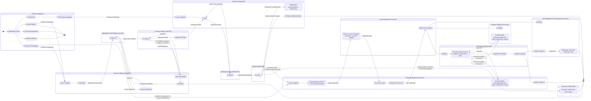

# API Marketplace Product Flows

```mermaid
stateDiagram-v2
    direction LR

    %% ===== Browse the Marketplace =====
    state "Visitor (not logged in)" as Visitor {
        [*] --> MarketplaceHome
        MarketplaceHome: Marketplace Home
        BrowseCatalogue: Browse API Catalogue
        BrowseGuidance: Browse Guidance
        AccessDocs: Access Documentation
        HelpSupport: Help & Support
        PublishAPIEntry: Publish API
        APIProducerStandards: API producer standards

        MarketplaceHome --> BrowseCatalogue
        MarketplaceHome --> BrowseGuidance
        MarketplaceHome --> AccessDocs
        MarketplaceHome --> HelpSupport
        MarketplaceHome --> PublishAPIEntry

        BrowseGuidance --> [*]
        AccessDocs --> [*]
        HelpSupport --> [*]

        PublishAPIEntry --> APIProducerStandards
    }

    %% ===== Request new API =====
    state "Consumer (Request new API)" as ReqNew_Consumer {
        LoginGateNew: Log in / Register
        SubmittedNew: Submitted
        MoreInfoNew1: More Info Needed
        MoreInfoNew2: More Info Needed
        DeclinedNew: Declined
    }

    state "Marketplace Team (Request new API)" as ReqNew_MT {
        InReviewNewMT: In Review
    }

    state "Producer (Request new API)" as ReqNew_Producer {
        InReviewNewProducer: In Review
        ApprovedToBuild: Approved to build
    }

    %% ===== Publish API =====
    state "Producer (Publish API)" as Publish_Producer {
        LoginGatePublish: Log in / Register
        Draft: Draft
        ProducerNotified: Producer notified (it's live)
        OngoingMaintenance: Ongoing API documentation & maintenance
    }

    state "Marketplace Team (Publish API)" as Publish_MT {
        InReviewPublish: In Review
    }

    state "System (Publish API)" as Publish_Sys {
        Listed: Listed
    }

    state "Consumer (Publish API)" as Publish_Consumer {
        ConsumerNotifiedListed: Consumer notified (new API is listed)
    }

    %% ===== Request API access =====
    state "Consumer (Request API access)" as ReqAccess_Consumer {
        LoginGateAccess: Log in / Register
        CreateApplication: Create Application (for the Try it now environment)
        TestTryItNow: Test via Try it now
        RequestProd: Requests Prod access
        ProvidesInfoConsumer: Provides further information (about the data, to help DAP's review)
        NotifyDecisionConsumer: Notify of decision
    }

    state "DAP (Request API access)" as ReqAccess_DAP {
        NotifiedDAP: Notified
        InReviewAccess: In Review (checks terms & conditions, reviews who + why)
        ApprovedDeclinedAccess: Approved / Declined
        NotifyDecisionDAP: Notify of decision
    }

    state "Producer (Request API access)" as ReqAccess_Producer {
        NotifiedProducer: Notified
        ProvidesInfoProducer: Provides further information (about the data, to help DAP's review)
    }

    state "System (Request API access)" as ReqAccess_Sys {
        IssueTryItNowCreds: Issue Try it now credentials (automatic, no review needed)
        NotifyProdRequest: Notify of Prod request
    }

    state "API Marketplace Team (Request API access)" as ReqAccess_Team {
        NotifiedTeam: Notified
        NotifyDecisionTeam: Notify of decision
        IssueProdCreds: If approved, issue Prod credentials / keys
    }

    %% ----- Request new API transitions -----
    LoginGateNew --> SubmittedNew
    SubmittedNew --> InReviewNewMT: Marketplace Team review
    InReviewNewMT --> MoreInfoNew1: needs clarification
    MoreInfoNew1 --> InReviewNewMT: responds
    InReviewNewMT --> InReviewNewProducer: hands off to Producer
    InReviewNewMT --> DeclinedNew: not feasible / duplicate
    InReviewNewProducer --> MoreInfoNew2: needs clarification
    MoreInfoNew2 --> InReviewNewProducer: responds
    InReviewNewProducer --> DeclinedNew: not feasible / duplicate (notifies Consumer)
    InReviewNewProducer --> ApprovedToBuild: approved to build
    DeclinedNew --> [*]

    %% ----- Publish API transitions -----
    LoginGatePublish --> Draft
    Draft --> InReviewPublish: submits for review
    InReviewPublish --> Draft: doesn't meet standards
    InReviewPublish --> Listed: meets publish standards
    Listed --> ProducerNotified: System notifies Producer
    ProducerNotified --> [*]
    Listed --> OngoingMaintenance: continues in a separate flow
    Listed --> ConsumerNotifiedListed: System notifies Consumer, if API was requested
    ConsumerNotifiedListed --> [*]

    %% ----- Request API access transitions -----
    LoginGateAccess --> CreateApplication
    CreateApplication --> IssueTryItNowCreds: creates application
    IssueTryItNowCreds --> TestTryItNow: credentials ready
    TestTryItNow --> RequestProd
    RequestProd --> NotifyProdRequest: same application

    NotifyProdRequest --> NotifiedDAP
    NotifyProdRequest --> NotifiedProducer
    NotifyProdRequest --> NotifiedTeam

    NotifiedDAP --> InReviewAccess
    InReviewAccess --> ProvidesInfoConsumer: more info needed (Consumer)
    ProvidesInfoConsumer --> InReviewAccess: responds
    InReviewAccess --> ProvidesInfoProducer: more info needed (Producer)
    ProvidesInfoProducer --> InReviewAccess: responds
    InReviewAccess --> ApprovedDeclinedAccess

    ApprovedDeclinedAccess --> NotifyDecisionDAP
    NotifyDecisionDAP --> NotifyDecisionConsumer
    NotifyDecisionDAP --> NotifyDecisionTeam

    NotifyDecisionConsumer --> [*]
    NotifyDecisionTeam --> IssueProdCreds: if approved
    IssueProdCreds --> [*]

    %% ----- Links between the four flows -----
    BrowseCatalogue --> LoginGateNew: continues at login gate
    HelpSupport --> LoginGateNew: continues at login gate
    APIProducerStandards --> LoginGatePublish: continues at login gate
    BrowseCatalogue --> LoginGateAccess: continues at login gate, Try it now is the first step
    ApprovedToBuild --> Draft: continues as Draft
    Listed --> LoginGateAccess: now discoverable, Consumer requests access
```
