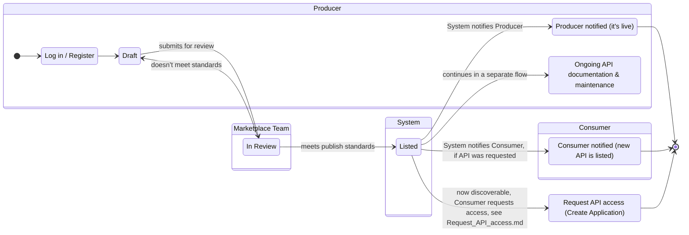

# Publish API

```mermaid
stateDiagram-v2
    direction LR

    state "Producer" as Publish_Producer {
        [*] --> LoginGatePublish
        LoginGatePublish: Log in / Register
        Draft: Draft
        ProducerNotified: Producer notified (it's live)
        OngoingMaintenance: Ongoing API documentation & maintenance
    }

    state "Marketplace Team" as Publish_MT {
        InReviewPublish: In Review
    }

    state "System" as Publish_Sys {
        Listed: Listed
    }

    state "Consumer" as Publish_Consumer {
        ConsumerNotifiedListed: Consumer notified (new API is listed)
    }

    RequestAPIAccessEntry: Request API access (Create Application)

    LoginGatePublish --> Draft
    Draft --> InReviewPublish: submits for review
    InReviewPublish --> Draft: doesn't meet standards
    InReviewPublish --> Listed: meets publish standards
    Listed --> ProducerNotified: System notifies Producer
    ProducerNotified --> [*]
    Listed --> OngoingMaintenance: continues in a separate flow
    Listed --> ConsumerNotifiedListed: System notifies Consumer, if API was requested
    ConsumerNotifiedListed --> [*]

    Listed --> RequestAPIAccessEntry: now discoverable, Consumer requests access, see Request_API_access.md
    RequestAPIAccessEntry --> [*]
```
