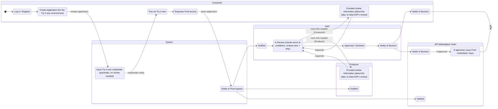

# Request API access

```mermaid
stateDiagram-v2
    direction LR

    state "Consumer" as ReqAccess_Consumer {
        [*] --> LoginGateAccess
        LoginGateAccess: Log in / Register
        CreateApplication: Create Application (for the Try it now environment)
        TestTryItNow: Test via Try it now
        RequestProd: Requests Prod access
        ProvidesInfoConsumer: Provides further information (about the data, to help DAP's review)
        NotifyDecisionConsumer: Notify of decision
    }

    state "DAP" as ReqAccess_DAP {
        NotifiedDAP: Notified
        InReviewAccess: In Review (checks terms & conditions, reviews who + why)
        ApprovedDeclinedAccess: Approved / Declined
        NotifyDecisionDAP: Notify of decision
    }

    state "Producer" as ReqAccess_Producer {
        NotifiedProducer: Notified
        ProvidesInfoProducer: Provides further information (about the data, to help DAP's review)
    }

    state "System" as ReqAccess_Sys {
        IssueTryItNowCreds: Issue Try it now credentials (automatic, no review needed)
        NotifyProdRequest: Notify of Prod request
    }

    state "API Marketplace Team" as ReqAccess_Team {
        NotifiedTeam: Notified
        NotifyDecisionTeam: Notify of decision
        IssueProdCreds: If approved, issue Prod credentials / keys
    }

    LoginGateAccess --> CreateApplication
    CreateApplication --> IssueTryItNowCreds: creates application
    IssueTryItNowCreds --> TestTryItNow: credentials ready
    TestTryItNow --> RequestProd
    RequestProd --> NotifyProdRequest: same application

    NotifyProdRequest --> NotifiedDAP
    NotifyProdRequest --> NotifiedProducer
    NotifyProdRequest --> NotifiedTeam

    NotifiedDAP --> InReviewAccess
    InReviewAccess --> ProvidesInfoConsumer: more info needed (Consumer)
    ProvidesInfoConsumer --> InReviewAccess: responds
    InReviewAccess --> ProvidesInfoProducer: more info needed (Producer)
    ProvidesInfoProducer --> InReviewAccess: responds
    InReviewAccess --> ApprovedDeclinedAccess

    ApprovedDeclinedAccess --> NotifyDecisionDAP
    NotifyDecisionDAP --> NotifyDecisionConsumer
    NotifyDecisionDAP --> NotifyDecisionTeam

    NotifyDecisionConsumer --> [*]
    NotifyDecisionTeam --> IssueProdCreds: if approved
    IssueProdCreds --> [*]
```
